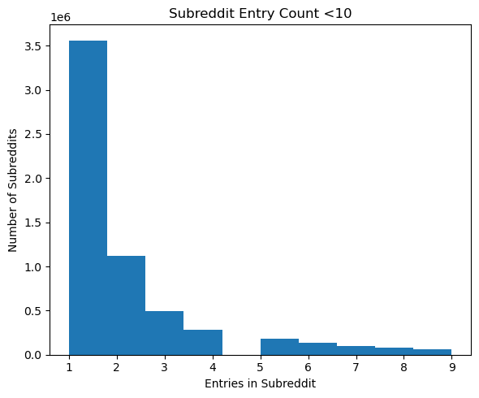
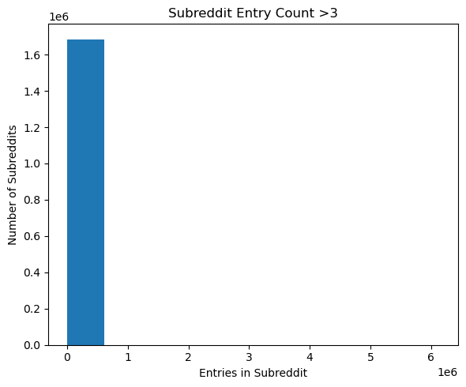
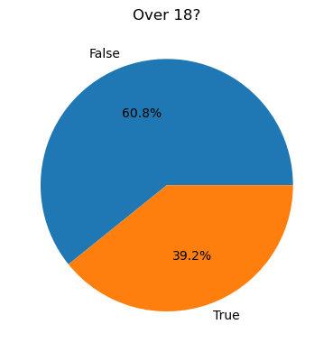
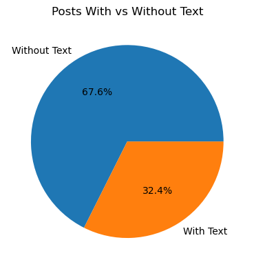

# DSC 232R Group Project
Gloria Kao, Mahir Oza, Ali Karim, Michael Nodini

## Repo Directory / Project Milestones

1. Abstract (see below)
2. Data Exploration
   - Code: [download_dataset.ipynb](https://github.com/gkao25/dsc-232r-project/blob/bb39ec4cd61d4468fb7779f2b82e6c5df5f93630/download_dataset.ipynb), [EDA.ipynb](https://github.com/gkao25/dsc-232r-project/blob/bb39ec4cd61d4468fb7779f2b82e6c5df5f93630/EDA.ipynb)
   - EDA Results: (see below) 
4. Preprocessing & First Model Building and Evaluation
5. Final Submission

## Abstract
Online forums like Reddit are often interested in identifying trends and patterns in user behavior to suggest uniquely curated topics of interest or channels to collaborate and discuss. This dataset is found on Kaggle and sourced from multiple Reddit subreddits (i.e. forums of different topics), and contains Reddit submission posts ranging from July 2021 to February 2023, totaling over 130GB of data, with each month provided as its own CSV file. Since this dataset contains NSFW topics (labeled as “over_18”), our project will analyze a subset of the dataset, produced during the data cleaning section by removing inappropriate topics. Nonetheless, the expected dataset size following our cleaning pipeline will still be over 50GB, requiring a high level of computing power that cannot be done by any normal consumer machine. Thus, we need to use distributed computing to load and work with the full dataset. Such a method provides cheap efficiency and makes the large dataset scalable for our project to work in a faster environment. Since much of the dataset is text-based, our research will focus on Natural Language Processing (NLP) to conduct Sentiment Analysis by different categories of subreddit (e.g. most/least positive subreddits), and Subreddit Prediction to train a classification model to predict the most suitable subreddit from unseen Reddit posts. The expected analysis would be useful for Reddit in cases that may involve moderation of subreddits or subreddit suggestions for users who may not know where to post.

## Datasets
"Reddit Submissions July 2021 to Oct 2022" from Kaggle: https://www.kaggle.com/datasets/noahpersaud/reddit-submissions-july-2021-to-oct-2022 

"Reddit Submissions Dec 2022 to Feb 2023" from Kaggle: https://www.kaggle.com/datasets/noahpersaud/reddit-submissions-dec-2022-to-feb-2023 

## SDSC Expanse Environment Setup

### SparkSession Configuration

```python
# Insert Code for SparkSession Configuration
from pyspark.sql import SparkSession

spark = SparkSession.builder \
    .config("spark.driver.memory", "2g") \
    .config("spark.executor.memory", "10g") \
    .config('spark.executor.instances', 15) \
    .appName("KaggleData") \
    .getOrCreate()
```
With our raw dataset sitting at approximately 132GB, with the memory of the driver allocated at 2GB, the best option for our setup requires an executor instance of 15 where we have 16 cores with one assigned to the driver. Additonally, with 15 executors needing to compute a dataset at this size (132GB with 2GB set aside for the driver), the memory allocated for each executor would be about 10GB (130GB/15 executors).

- Executor instances = Total Cores - 1 = 15
- Executor Memory = (Total Memory - Driver Memory) / Executor Instances = (132-2) / 15 = 8.67

### Screenshot of SparkUI Showing Active Executors:


## Data Exploration Using Spark

**Number of Observations in Raw Dataset: 654,221,435**

*Note: Dataset contains no image data - completely text based*

### Columns (Scales, Distributions, Categorical/Continuous Type, & Feature/Target) of Dataset:

| Column | Description | Scale | Distribution | Categorical/Quantitative (Type) | Feature/Target|
|---|---|---|---|---|---|
| title | Provides the naming of the post made by some reddit user | string/text-based naming | any sequence of characters of any length | categorical | feature |
| post_id | Links unique identifier to each post entry made by users on site | string | distinct 6-digit code | categorical | feature |
| over_18 | Boolean identifier to flag if a post/subreddit is NSFW (TRUE) or SFW and appropriate (FALSE) | Boolean | True or False | categorical (binary) | feature |
| subreddit | Title descriptor for forum on which users can communicate, hold discussions, and interact | string | any sequency of characters of any length | categorical | target |
| link_flair_text | Tags on post to help identify specific features contained within the post | string | any sequence of characters typically of a relatively short length | categorical | feature |
|self_text | Primary body that makes up the forum post | string | any sequence of characters of any length | categorical | feature |

### Missing/Duplicate Values Within Dataset:
This data does contain missing values that are primarily seen in features for `link_flair_text` and `self_text`. Additionally, `self_text` contains text like '[deleted]' or '[removed]', which we will consider as missing data. We observe duplicate data for the subreddits, and it is expected to have multiple posts from the same forum. Thus, we will not be dropping or handling any duplicates in the subreddit target column. The only feature to worry about having duplicates would be the `post_id`, since this is a unique identifier for each post made. If there are any duplicte `post_id`'s, our plan to handle it would be to test and see if each duplicate instance is the same for all 6 columns. If it is, then we will keep only one instance and drop the rest; if it is not, we will drop every instance of the duplicate `post_id`.

### Null and Empty Values Count:
| Column           | Missing Count |
|------------------|--------------|
| title            | 336          |
| post_id          | 17933        |
| over_18          | 20405        |
| subreddit        | 21505        |
| link_flair_text  | 425,449,504  |
| self_text        | 345,790,643  |

### Subreddit Distribution:
This table shows a summary of the distribution of subreddit entries. 75% of the subreddits have less than 3 entries. This imbalance in data will be important later when we try to evaluate our prediction model.

|   |subreddit count|
|--------|-------------|
|count	|6.86 million|
|mean	|95.41|
|std	|5,258.66|
|min	|1|
|25%	|1|
|50%	|1|
|75%	|3|
|max	|6,139,237|


## Data Plots

*Spark Aggregation-based visualizations*

This bar chart shows the **top 10 most common subreddits** out of over 6 million unique subreddits in the dataset. 


The following two graphs show the distribution of subreddits with less than 10 entries (very little entries) versus more than 3 entries (top quartile of subreddit entries count). In combination to the above graph, we can see that a few subreddits like AskReddit and DirtyKikPals have significantly higher counts compared to others, and most posts are concentrated in a small number of communities. This suggests the dataset is highly imbalanced, with certain subreddits dominating the data. We'll also notice quite a bit of these subreddits relate to some innappropriate, NSFW forum that we'll want to filter out later on.





This pie chart shows the **distribution of NSFW (18+) versus non-NSFW posts** in the dataset. Most posts are not marked as 18+, with approximately 400 million non-NSFW posts compared to around 260 million NSFW posts. This indicates that while adult content is present, most Reddit posts fall under non-NSFW categories.



This plot shows that **around 2/3 of the dataset do not contain text content** (i.e. `self_text` is Null or removed), indicating that Reddit submissions are often links, images, or removed content rather than full text posts. Missing data like this is significant in showing that the prime feature for which we hoped to build our models will either not be able to be considered in determining subreddits or cause the post to be dropped entirely. It's also an important analytic indicator to show that while some posts may have a title but not post text, there are other aspects to posts that could just involve circumstance such as another non-text based medium, a post is taken down by a user, or that some posts could be getting flagged and removed for violating reddit policy.




A **flair** is a label assigned to a Reddit post that indicates its category or type. It helps organize content within a subreddit and provides insight into the type of posts being shared. This chart shows the **top 10 most common link flairs**. This gives a sense of what the most popular posts tend to be about or associated to. We can see that approximately 20 million posts are split between being Discussions or Questions posted across forums.


## Preprocessing Plan

### Handling Missing Values:
The primary feature we will be looking at to determine subreddit is the post title (`title`) and the post itself (`self_text`), so any posts with a missing or duplicate title or post text will be dropped from the usable set. These features are vital to calculating sentiment scores in predicting the subreddit, so making predictions with missing data in these columns could cause the model to make faulty subreddit predictions. Similarly, any entries missing a subreddit will also be dropped from consideration for our training, validation, and test sets, since it would not be possible to predict and compare on a post missing the target variable, subreddit. Finally, since we don't want to risk having NSFW posts/subreddits as part of our prediction model, we will drop rows that have missing values for the `over_18` column, because at this scale, we are unable to determine if the posts and forums relate to inappropriate entries. Since the other features will be less important for prediction, any missing values encountered for those posts will be kept to potentially make more accurate predictions. 

> The predicted size of the processed dataset will be: (original size) * (proportion of dataset with text) * (proportion of dataset under 18) = 130 * (1/3) * (1/2) = 43GB.

### Data Imbalance:
Since this dataset contains millions of different subreddits, it becomes clear that some of these forums appear very few times (many only once) while other subreddits are seen much more frequently. When training our models to predict subreddits for posts, many subreddits will have multiple posts to train up on compared to other subreddits which would have few to almost no entries to train on. This could lead to biased prediction in our model. When predicting the validation/test set, those subreddits that the model had multiple entries to train on are going to be easier to predict, versus the many other subreddits that the model has not seen and thus struggle to accurately predict. To ensure fairness to different subreddits, we will be dropping any subreddits that have fewer than 10 occurrences within the overall dataset so that we can expect our model to be able to train up on the subreddits it would expect to see from the validation/test sets.

### Data Transformations (Scaling, Encoding, Feature Engineering):
Unfortunately, a good portion of this dataset contains NSFW content, highlighted by the `over_18` feature. Thus, our first step of preprocessing is to transform our data into something appropriate, by droping all entries labeled TRUE for this column. This will drop a good portion of rows and make our dataset much more scalable as we move forward with our modeling plan. While we acknowledge these subreddits are important to deterministic aspects to Reddit's business model, from an academic and comfrtability standpoint, this is the most appropriate path forward for our group. 

Before we perform sentiment analysis and train our model, we will clean the text data to make them more uniform. Such cleaning includes ensuring the correct datatype, turning all text into lower-case, resolving unknown values, etc. Then we can leverage transformation encodings such as TF-IDF, One-Hot Encoding (OHE), or Word2Vec methods such as the VADER Lexicon for sentiment analysis. This will be necessary for the NLP techniques we plan to implement in order to process the thousands of text-based post features we are utilizing, so that our model can predict subreddits accurately. We will apply sentiment analysis to each of the `self_text` rows, then group all sentiment scores (on a scale from -1 for most negative to +1 for most positive) according to subreddit. This will provide us with a way to see which 5 subreddits have the most positive or negative sentiment.


### Spark Operations for Preprocessing:

```python
df.printSchema() # provides understanding of dataset structure for processing
df.show(5) # visualize a subset of dataset prior to beginning processing
df.describe.show() # statistical summary of distribution of values across dataset columns
df.count() # Number of Entries in Raw Dataset prior to Processing: 654221435
df.select("subreddit").distinct().count() # Unique Subreddits: 6857314
df.where("over_18 = false") # subset of posts that are appropriate for all users
```
