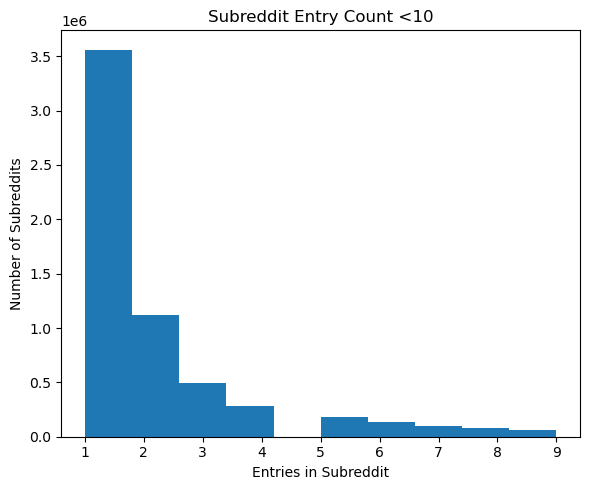
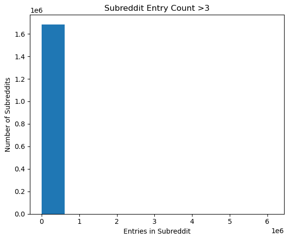
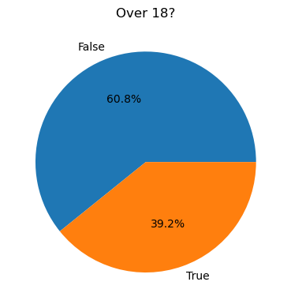
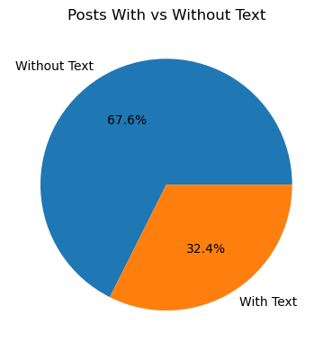
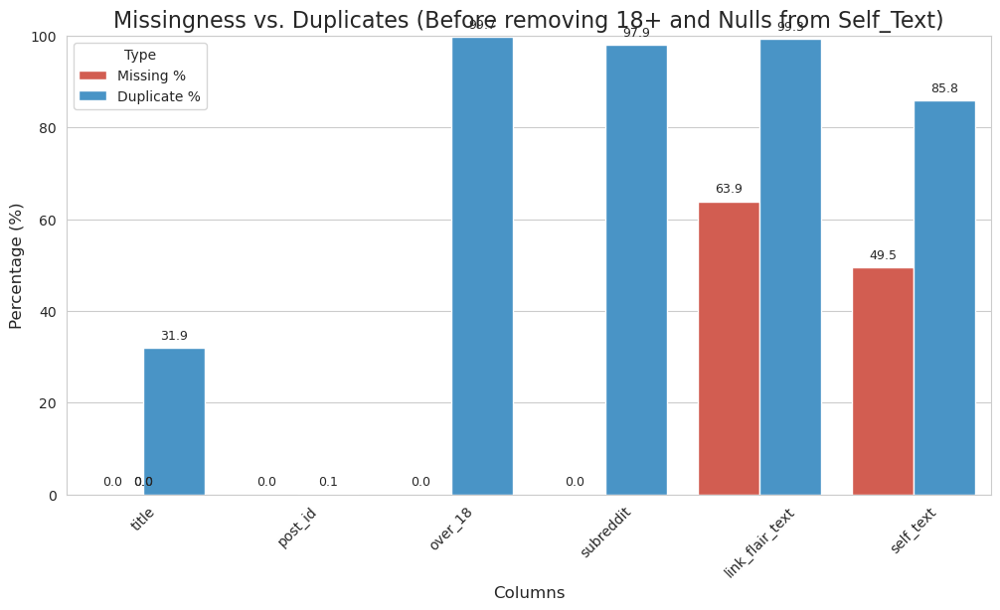
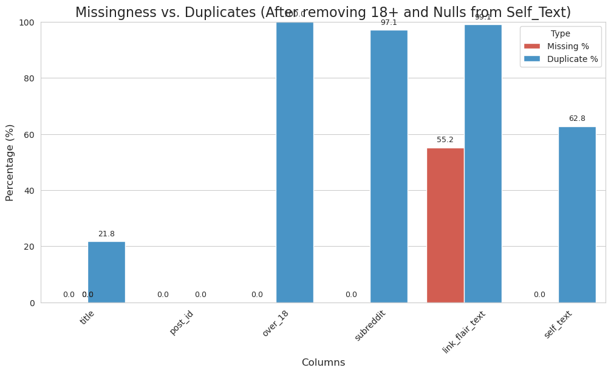
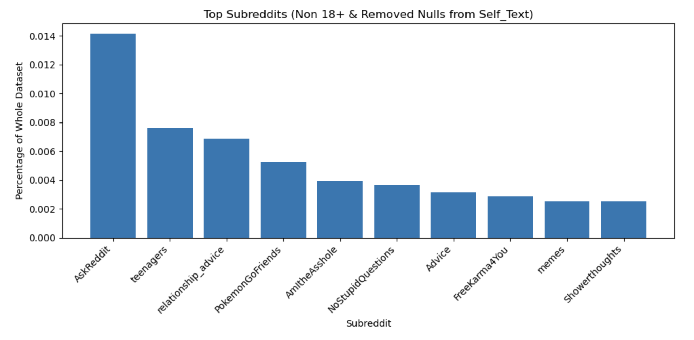
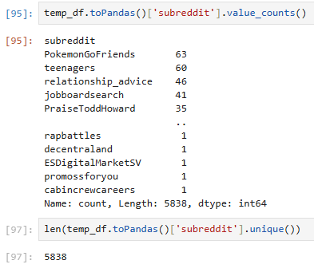

# DSC 232R Group Project
Gloria Kao, Mahir Oza, Ali Karim, Michael Nodini

## Repo Directory / Project Milestones

1. Abstract [here](#abstract)
2. Data Exploration
   - Code: [download_dataset.ipynb](https://github.com/gkao25/dsc-232r-project/blob/bb39ec4cd61d4468fb7779f2b82e6c5df5f93630/download_dataset.ipynb), [EDA.ipynb](https://github.com/gkao25/dsc-232r-project/blob/bb39ec4cd61d4468fb7779f2b82e6c5df5f93630/EDA.ipynb)
   - EDA Results: [see below](#data-exploration-using-spark)
3. Preprocessing & First Model Building and Evaluation
   - Code: [preprocessing_training.ipynb](https://github.com/gkao25/dsc-232r-project/blob/main/preprocessing_training.ipynb), [training2.ipynb](https://github.com/gkao25/dsc-232r-project/blob/main/training2.ipynb)
   - Preprocessing Description: [see below](#preprocessing-plan)
   - Model Evaluation: [see below](#distributed-model)
4. Final Submission
   - Code:
   - Dimensionality Reduction: [see below](#dimensionality-reduction-model)
   - Written Report: [see below](#written-report)

## Abstract
Online forums like Reddit are often interested in identifying trends and patterns in user behavior to suggest uniquely curated topics of interest or channels to collaborate and discuss. This dataset is found on Kaggle and sourced from multiple Reddit subreddits (i.e. forums of different topics), and contains Reddit submission posts ranging from July 2021 to February 2023, totaling over 130GB of data, with each month provided as its own CSV file. Since this dataset contains NSFW topics (labeled as “over_18”), our project will analyze a subset of the dataset, produced during the data cleaning section by removing inappropriate topics. Nonetheless, the expected dataset size following our cleaning pipeline will still be over 50GB, requiring a high level of computing power that cannot be done by any normal consumer machine. Thus, we need to use distributed computing to load and work with the full dataset. Such a method provides cheap efficiency and makes the large dataset scalable for our project to work in a faster environment. Since much of the dataset is text-based, our research will focus on Natural Language Processing (NLP) to conduct Sentiment Analysis by different categories of subreddit (e.g. most/least positive subreddits), and Subreddit Prediction to train a classification model to predict the most suitable subreddit from unseen Reddit posts. The expected analysis would be useful for Reddit in cases that may involve moderation of subreddits or subreddit suggestions for users who may not know where to post.

## Datasets
"Reddit Submissions July 2021 to Oct 2022" from Kaggle: https://www.kaggle.com/datasets/noahpersaud/reddit-submissions-july-2021-to-oct-2022 

"Reddit Submissions Dec 2022 to Feb 2023" from Kaggle: https://www.kaggle.com/datasets/noahpersaud/reddit-submissions-dec-2022-to-feb-2023 

## SDSC Expanse Environment Setup

### SparkSession Configuration

```python
# Insert Code for SparkSession Configuration
from pyspark.sql import SparkSession

spark = SparkSession.builder \
    .config("spark.driver.memory", "2g") \
    .config("spark.executor.memory", "10g") \
    .config('spark.executor.instances', 15) \
    .appName("KaggleData") \
    .getOrCreate()
```
With our raw dataset sitting at approximately 132GB and the memory of the driver allocated at 2GB, the best option for our setup requires 16 cores total, with 1 assigned to the driver and 15 as executor instances. Additonally, to distribute the 132GB of raw data comfortably, the memory allocated for each executor is about 10GB. The total requested memory is 152GB. 

- Executor Instances = Total Cores - 1 = 15
- Executor Memory = (Total Memory - Driver Memory) / Executor Instances = (152-2) / 15 = 10
- With a 132GB dataset and 15 instances, we need at least (132-2)/15 = 8.67GB per executor. 

### Screenshot of SparkUI Showing Active Executors:


## Data Exploration Using Spark

**Number of Observations in Raw Dataset: 654,221,435**

*Note: Dataset contains no image data - completely text based*

### Columns (Scales, Distributions, Categorical/Continuous Type, & Feature/Target) of Dataset:

| Column | Description | Scale | Distribution | Categorical/Quantitative (Type) | Feature/Target|
|---|---|---|---|---|---|
| title | Provides the naming of the post made by some reddit user | string/text-based naming | any sequence of characters of any length | categorical | feature |
| post_id | Links unique identifier to each post entry made by users on site | string | distinct 6-digit code | categorical | feature |
| over_18 | Boolean identifier to flag if a post/subreddit is NSFW (TRUE) or SFW and appropriate (FALSE) | Boolean | True or False | categorical (binary) | feature |
| subreddit | Title descriptor for forum on which users can communicate, hold discussions, and interact | string | any sequency of characters of any length | categorical | target |
| link_flair_text | Tags on post to help identify specific features contained within the post | string | any sequence of characters typically of a relatively short length | categorical | feature |
|self_text | Primary body that makes up the forum post | string | any sequence of characters of any length | categorical | feature |

### Missing/Duplicate Values Within Dataset:
This data does contain missing values that are primarily seen in features for `link_flair_text` and `self_text`. Additionally, `self_text` contains text like '[deleted]' or '[removed]', which we will consider as missing data. We observe duplicate data for the subreddits, and it is expected to have multiple posts from the same forum. Thus, we will not be dropping or handling any duplicates in the subreddit target column. The only feature to worry about having duplicates would be the `post_id`, since this is a unique identifier for each post made. If there are any duplicte `post_id`'s, our plan to handle it would be to test and see if each duplicate instance is the same for all 6 columns. If it is, then we will keep only one instance and drop the rest; if it is not, we will drop every instance of the duplicate `post_id`.

### Null and Empty Values Count:
| Column           | Missing Count |
|------------------|--------------|
| title            | 336          |
| post_id          | 17933        |
| over_18          | 20405        |
| subreddit        | 21505        |
| link_flair_text  | 425,449,504  |
| self_text        | 345,790,643  |

### Subreddit Distribution:
This table shows a summary of the distribution of subreddit entries. 75% of the subreddits have less than 3 entries. This imbalance in data will be important later when we try to evaluate our prediction model.

|   |subreddit count|
|--------|-------------|
|count	|6.86 million|
|mean	|95.41|
|std	|5,258.66|
|min	|1|
|25%	|1|
|50%	|1|
|75%	|3|
|max	|6,139,237|


## Data Plots

*Spark Aggregation-based visualizations*

This bar chart shows the **top 10 most common subreddits** out of over 6 million unique subreddits in the dataset. 


The following two graphs show the distribution of subreddits with less than 10 entries (very little entries) versus more than 3 entries (top quartile of subreddit entries count). In combination to the above graph, we can see that a few subreddits like AskReddit and DirtyKikPals have significantly higher counts compared to others, and most posts are concentrated in a small number of communities. This suggests the dataset is highly imbalanced, with certain subreddits dominating the data. We'll also notice quite a bit of these subreddits relate to some innappropriate, NSFW forum that we'll want to filter out later on.





This pie chart shows the **distribution of NSFW (18+) versus non-NSFW posts** in the dataset. Most posts are not marked as 18+, with approximately 400 million non-NSFW posts compared to around 260 million NSFW posts. This indicates that while adult content is present, most Reddit posts fall under non-NSFW categories.




This plot shows that **around 2/3 of the dataset do not contain text content** (i.e. `self_text` is Null or removed), indicating that Reddit submissions are often links, images, or removed content rather than full text posts. Missing data like this is significant in showing that the prime feature for which we hoped to build our models will either not be able to be considered in determining subreddits or cause the post to be dropped entirely. It's also an important analytic indicator to show that while some posts may have a title but not post text, there are other aspects to posts that could just involve circumstance such as another non-text based medium, a post is taken down by a user, or that some posts could be getting flagged and removed for violating reddit policy.




A **flair** is a label assigned to a Reddit post that indicates its category or type. It helps organize content within a subreddit and provides insight into the type of posts being shared. This chart shows the **top 10 most common link flairs**. This gives a sense of what the most popular posts tend to be about or associated to. We can see that approximately 20 million posts are split between being Discussions or Questions posted across forums.


### EDA After Removing Nulls:

On a subset of dataset (around 4% of total), we removed the entries that are labeled over 18 and have no self_text, and compared the proportions of missing/duplicates. 




Here is another graph showing the top 10 most common subreddits, after the removing all the unwanted entries from the full dataset. The ranking has changed drastically and removed the clearly inappropriate subreddits such as Dirtykikpals.




## Preprocessing Plan

### Handling Missing Values:
The primary feature we will be looking at to determine subreddit is the post title (`title`) and the post itself (`self_text`), so any posts with a missing or duplicate title or post text will be dropped from the usable set. These features are vital to calculating sentiment scores in predicting the subreddit, so making predictions with missing data in these columns could cause the model to make faulty subreddit predictions. Similarly, any entries missing a subreddit will also be dropped from consideration for our training, validation, and test sets, since it would not be possible to predict and compare on a post missing the target variable, subreddit. Finally, since we don't want to risk having NSFW posts/subreddits as part of our prediction model, we will drop rows that have missing values for the `over_18` column, because at this scale, we are unable to determine if the posts and forums relate to inappropriate entries. Since the other features will be less important for prediction, any missing values encountered for those posts will be kept to potentially make more accurate predictions. 

> The predicted size of the processed dataset will be: (original size) * (proportion of dataset with text) * (proportion of dataset under 18) = 130GB * (1/3) * (1/2) = 21GB. Processed dataset will still meet the required minimum of 10GB, which cannot fit comfortably in a laptop and requires Spark distributed processing.

### Data Imbalance:
Since this dataset contains millions of different subreddits, it becomes clear that some of these forums appear very few times (many only once) while other subreddits are seen much more frequently. When training our models to predict subreddits for posts, many subreddits will have multiple posts to train up on compared to other subreddits which would have few to almost no entries to train on. This could lead to biased prediction in our model. When predicting the validation/test set, those subreddits that the model had multiple entries to train on are going to be easier to predict, versus the many other subreddits that the model has not seen and thus struggle to accurately predict. To ensure fairness to different subreddits, we will be dropping any subreddits that have fewer than 10 occurrences within the overall dataset so that we can expect our model to be able to train up on the subreddits it would expect to see from the validation/test sets.

### Data Transformations (Scaling, Encoding, Feature Engineering):
Unfortunately, a good portion of this dataset contains NSFW content, highlighted by the `over_18` feature. Thus, our first step of preprocessing is to transform our data into something appropriate, by droping all entries labeled TRUE for this column. This will drop a good portion of rows and make our dataset much more scalable as we move forward with our modeling plan. While we acknowledge these subreddits are important to deterministic aspects to Reddit's business model, from an academic and comfrtability standpoint, this is the most appropriate path forward for our group. 

Before we perform sentiment analysis and train our model, we will clean the text data to make them more uniform. Such cleaning includes ensuring the correct datatype, turning all text into lower-case, resolving unknown values, etc. Then we can leverage transformation encodings such as TF-IDF, One-Hot Encoding (OHE), or Word2Vec methods such as the VADER Lexicon for sentiment analysis. This will be necessary for the NLP techniques we plan to implement in order to process the thousands of text-based post features we are utilizing, so that our model can predict subreddits accurately. We will apply sentiment analysis to each of the `self_text` rows, then group all sentiment scores (on a scale from -1 for most negative to +1 for most positive) according to subreddit. This will provide us with a way to see which 5 subreddits have the most positive or negative sentiment.


### Spark Operations for Preprocessing:

```python
df.printSchema() # provides understanding of dataset structure for processing
df.show(5) # visualize a subset of dataset prior to beginning processing
df.describe.show() # statistical summary of distribution of values across dataset columns
df.count() # Number of Entries in Raw Dataset prior to Processing: 654221435
df.select("subreddit").distinct().count() # Unique Subreddits: 6857314
df.where("over_18 = false") # subset of posts that are appropriate for all users
```

## Completion of Preprocessing
After planning the preprocessing goals set forth in previous sections to filter down our dataset and ensure its readiness when the time comes for modeling, we began our implementation of these ideas using SparkDataframe operations. Before we could look at missing values or even the feature sets themselves, we felt it would be best to first filter out the posts that were tagged as `over_18`, which makes computation faster, and also makes us more comfortable to read the entries. Since our data is almost entirely text based (including the post ids since they are unique codes albeit represented numerically), the idea of scaling text to new values or imputing missing values with made up ones do not entirely make sense. However, as we outlined earlier, we needed a way to handle these instances of missing, removed, or deleted data in the features we identified as being most vital - `subreddit` and `self_text`. Since the main input component to our model will come from `self_text` we felt it would be okay to allow missing `title` entries as long as they both had `subreddit` and `self_text` values. Once our dataset was cleaned of inconsistent values, we wanted to implement some type of encoding. Using VectorAssembler and choosing the Hugging Face Tokenizer, encode our text-based feature set of `self_text` and `title` prior to modeling. The different models we end up implementing will be more efficient when interpeting the data, identifying patterns, and making insightful decisions. Using a pre-trained tokenizer like this rather than requiring clusters to talk to each other, it will be faster and more efficient to transform our data backed by a tested and common tokenizer to handle our text feature. Once our dataset was completed our final processing task was to split the data to train and test our model. Using a 70-15-15 split, we separate our dataset so that 70% of it will be accounted for in the training set, 15% will make up the vaildation set, and the final 15% of the data will set up our test set. 

## Distributed Model
**Distributed Model: Decision Trees/Random Forests**

Implementation:
[Jupyter Notebook Code](https://github.com/gkao25/dsc-232r-project/blob/main/preprocessing_training.ipynb)

```python
pyspark.ml.classification.DecisionTreeClassifier
pyspark.ml.classification.RandomForestClassifier
```
*Note: Model successfully run through SDSC Expanse to avoid local issues for large datasets. Only a subset of 1% is used for training.*

**Multiple Executors Used:**\


**Model 1 Hyperparameters: numTrees = 10, maxDepth = 5, maxBins = 32, seed = 42**

### Training and Test Error of Random Forest Classifier
| Training Error | Validation Error | Test Error |
| --- | --- | --- |
| 95.886% | 95.873% | 95.909% | 

### Supervised Learning Approach
| Dataset Type | Ground Truth Subreddit | Predicted Subreddit | Accuracy |
| --- | --- | --- | --- |
| Train | apexlegends | apexlegends | Correct |
| Train | AskReddit | Advice | Incorrect |
| Validation | sneakerhead | sneakerhead | Correct |
| Validation | teenagers | relationship_advice | Incorrect |
| Test | FashionReps | FashionReps | Correct |
| Test | AskReddit | Advice | Incorrect |


### Results with Different Hyperparameters
**Model 2 RF Hyperparameters: numTrees = 15, maxDepth = 5, maxBins = 32, seed = 42**
| Training Error | Validation Error | Test Error |
| --- | --- | --- |
| 95.862% | 95.877% | 95.874% |

**Model 3 Decision Tree Hyperparameters: maxDepth = 3, maxBins = 16, impurity = "entropy", seed = 42**

|Training Error	| Validation Error|	Test Error|
| --- | --- | --- |
|97.915%	|97.926%|	97.837%|

| Dataset Type | Ground Truth Subreddit | Parameterized Model Predicted Subreddit | Accuracy |
| --- | --- | --- | --- |
| Train | PokemonGoFriends | PokemonGoFriends | Correct |
| Train | NoStupidQuestions | Advice | Incorrect |
| Validation | plantwatch | plantwatch | Correct |
| Validation | teenagers | AskReddit | Incorrect |
| Test | apexlegends | apexlegends | Correct |
| Test | Advice | relationship_advice | Incorrect |


## Analysis of Distributed Model

### Interpretation of High Error Rates
**Fitting Graph:** The results between our training, validation, and test set for the decision tree-based model tend to be pretty similar. Overfitting, typically, can be seen when the model performs well or better on the training set compared to the validation/test set of unseen data where it performs worse since the model hasn't had a chance to get used to new data. The similarity between the poor accuracy of all 3 sets isn't really an indicator our model is overfitting since it's not even fitting well on the training data to begin with.\
Underfitting occurs when the model is too simple and does not capture the patterns inherent in the text well enough to predict with good accuracy depsite the dataset, which is similar to what we are seeing here. The high error rates could be due to the fact that we have a large number of labels to classify and the distribution is highly imbalanced (as previously explained in the EDA). Below is a screenshot showing the value counts of unique subreddits in a 0.01% sample. There is a total of 5838 unique subreddits, many of which only has 1 entry. Thus, the error rate of 95% is better than randomly predicting labels. For this sample dataset, the probability of randomly assigning the correct label 1/5838=0.00017



### Comparing Different Hyperparameters
Our two Random Forest classifiers performed similarly despite different hyperparameters (10 vs. 15 trees). We also tried fitting Decision Trees with different max depths, but Random Forest proved to perform better, although both have bad accuracy. Our motivation was to view the scale of the effect between the Decision Tree approach and Random Forest approach to see if the RF Model is worth accounting for aspects like multiple trees or a more lenient parameter set for depth and bins. We can clearly see based on the table that Model 1&2 clearly perform better when implementing the Random Forest approach compared to Model 3's more simplistic case. For different hyperparameter sets that we tried, regardless of the implementation while accounting for the trade-off with complexity, we struggled to really get an accurate model primarily due to issues with the different subreddit options, various subreddits being incredibly similar in their purpose, and subreddits potentially being split entirely into a validation or test set and missing from the training set. Thus, we have the following Naive Bayes' model.

> We are aware that this is a deviation from the project requirement. Our motivation is simply wanting to see a model with at least 60% accuracy, and perhaps as an early start to Milestone 4.

### Naive Bayes' Multinomial Model
[Jupyter Notebook Code](https://github.com/gkao25/dsc-232r-project/blob/main/training2.ipynb)

This model shows much better accuracy of approxmiately 61%. We achieved this by filtering the dataset so that only the top 100 subreddits are used for training, and this solved the problem of an imbalanced dataset. We also tried different hyperparameters on this model. A smaller smoothing coefficient is supposed to help with underfitting (low accuracy), however, it did not have much effect here, as you can see in the tables below.

**Hyperparamter: smoothing = 1.0**
|Training Error	|	Test Error|
| --- | --- | 
|38.75%	|38.56%|

**Hyperparamter: smoothing = 0.1**
|Training Error	|	Test Error|
| --- | --- | 
|38.74%	|38.56%|


### Additional Planned Model Options
For our next model, aside from continuing our research with the Naive Bayes' model, we are also interested in trying a distributed XGBoost implementation using Spark (SparkXGBClassifier). This is designed to scale to larger datasets, like this Reddit data, and may better capture relationships in the text compared to a Decision Tree or Random Forest approach. Since our current models appear to underfit quite drastically, we think XGBoost may improve predictive performance while still taking advantage of distributed computing on Expanse. Our goal is to not just try one model, but to be able to create a dynamic implementation wherein tuning different hyperparameters will help us compare different models, some of which may overfit our data while performing well on the training set and other tuned models which could perform worse on the training set but better comparatively on our validation/test set. 


## Conclusion of Distributed Model
**Conclusion:** The distributed Spark Decision Tree and Random Forest models were able to successfully run on a the portion of the Reddit dataset we had following our steps for preprocessing, but unfortunately our overall performance was still relatively low. The results suggest that the models are underfitting, since the training, validation, and testing scores stayed low and very similar to each other. This means the models struggled to learn meaningful patterns to accurately predict subreddits from text alone. This is likely an indication that for the means of our model, classifying from a diverse text-based feature set to predict on a large target set is not very attainable using a Random Forest or Decision Tree model. \
We also can see that there are quite a bit of subreddits that have are incredibly similar in function and thus have similar posts. As we move forward, this will be a likely issue we continue to see and a true struggle that is evident in these types of complex real-world tasks. High levels of nuance and little to no variation among certain values in the target set make it hard to classify, especially on feature sets that are typically unique and subjective. Even though the accuracy was limited, this milestone helped establish a working distributed preprocessing and model pipeline on SDSC Expanse. Our Naive Bayes' approach also showed that more advanced models and better text features will likely be needed to improve performance in Milestone 4.

**Potential Improvements:** Despite our best efforts to select different hyperparameters, the model struggles to accurately predict subreddits. The issue can primarily be pinpointed down to the incredibly large amounts of subreddits that show up in our dataset even though we tried to implement a threshold. Since some subreddits show up at a comparatively larger proportion than others and most show up very few times, our training set simply does not have the balanced distribution that we would like to be able to predict with a lower error. By chance when splitting with the amount of subreddits, it's likely many subreddits are not included as options from our training set and will ultimately fail in validation and test. A fix would be to require every subreddit to have at least 3 entries when splitting our training, validation, and test sets. Additionally, there are too many subreddit options for which our model is trying to pick the best one on, many subreddits being very similar. A better way to be able to improve our model while maintaining its large size would be to only work on the largest subset of the top 10, 20, or 100 subreddits with the most posts. This would of course alter the predictive capacity of our model (limiting the options from which our model will predict), but also has the potential to improve the model's prediction accuracy by focusing on the subreddits that have more data and learnable patterns. 

**Distributed Computing:** Leveraging various independent computing nodes to handle reading, processing, training, and evaluating our dataset is a necessary aspect of working with a dataset of this size. Since many of our normal machines cannot run these steps locally based on the size of this dataset, splitting up the tasks across different resources allows these resources to not just be set up to handle data of this size but also run them concurrently across machines. In other words, while its possible to scale our data to a processor that can handle the size, splitting up the task across various nodes will increase computational efficiency by allowing various different nodes to try to do the same work in a faster timeframe than if everything was done individually and sequentially from one large resource.

## Dimensionality Reduction Model
**Dimension Reduced Model: Principal Component Analysis (PCA)**

Implementation:
*insert notebook*

```python
pyspark.ml.feature.PCA
```

### Dimensionality Reduction (Clustering, Visualization/Interpretation, Supervised Model)
Our approach to implementing a dimension reduced model was to employ a supervised modeling approach by training our model on a set of reduced-dimension features. As part of our dimensionality reduction we also incoporated a TF-IDF vectorizer on our model inputs to focus our model training on the words that are most important, common, and valuable to subreddit posts and allow the model to ignore text that does not contribute as strongly to a subreddit. This focuses the model on the most important aspects of a post that contribute to subreddit determination to find and use commonality among posts and minimizing our models idea of variance that other methods would be unable to acknowledge and work upon. 

*Note: Model successfully run through SDSC Expanse to avoid local issues for large datasets.*

**Multiple Executors Used:**\


### Training and Test Error of PCA Model
| PCA Model | Training Error | Test Error |
| --- | --- | --- |
| PCA Baseline | 79.69% | 79.81% | 
| PCA + XGBoost | 68.36% | 68.39% |
| PCA + Logistic Regression | 92.18% | 92.16% |

For all 3 employments of the PCA models, the training and test error for each model is relatively very similar. However, despite all 3 models performing relatively poorly, we can see clear differences between the models. The best performing model is PCA with XGBoost, followed by the baseline PCA, and worst of all was PCA with logistic regression. 

### PCA Explained Variance Analysis
| PCA Model | Explained Variance | Initial 10 Components |
| --- | --- | --- |
| PCA Baseline | 0.5782 | [0.084247, 0.073207, 0.047140, 0.044247, 0.030013, 0.027319, 0.023568, 0.017341, 0.016214, 0.011690] | 
| PCA + XGBoost | 0.6248 | [0.236053, 0.041906, 0.031039, 0.027319, 0.022965, 0.021760, 0.019578, 0.014357, 0.013182, 0.012080] |
| PCA + Logistic Regression | 0.5813 | [0.283320, 0.039514, 0.030347, 0.028484, 0.026008, 0.017901, 0.016024, 0.015791, 0.013440, 0.010368] |

Across all 3 models, only 58-62% of the variance can be explained by the setups employed showing a medium preservation of original information with about 38-42% of the variance discarded. This infroms us that our models are likely disregarding and ignoring useful structures that could help identify and discriminate across subreddits. This furthers our earlier conclusions that our data is highly complex stemming from large variation in posts within each subreddit, non-linear relationships between features and subreddit, and perhaps even some aspects of the features still leveraged performing weakly. While the components for the PCA Baseline model are all somewhat similar we see the first component (PC1) for the XGBoost and Logistic Regression implementation of the PCA models are far greater than the rest of the components, 23.61% and 28.33% respectively. This means these 2 models have a large portion of the variance caputured by the first components in relation to the other 9 implying the transformed feature space has become concentrated along a singular direction. This can be due to strong correlation among a feature, redundancy, or information across axes being tightly compressed. 

*Note: No clustering quality since dimensionality reduction did not leverage clustering*

### Analysis
**Fitting Graph:** Across all 3 PCA models we can see very close similarities between each model's training and test errors. For example, the PCA Baseline model had a training error of 79.69% while the test error was only 0.12% worse performing with a 79.81% inaccuracy. We see very small difference between training and test error for the other two models as well. This indifference between the training and test sets along with all 3 PCA models performing pretty badly (all worse than 50% error) lead to a conclusion of our models underfitting our data. PCA modeling on this type of data is unable to accurately identify patterns and trends within posts from the training set and when passed on the test set can really only perform well on posts similar to what it could accurately identify in the training set and thus performs equally as poorly. 

**Potential Improvements/Additional Models:**

**Effect of Dimensionality Reduction:**

### Conclusion
**2nd Model:**

**Improvements:**

### Prediction Analysis
| Model Type | Prediction | Truth | Prediction Type/Justification |
| --- | --- | --- | --- |
| PCA + XGBoost | ADHD | ADHD | Correct (ADHD): The predicted value (`ADHD`) matches with the subreddit's true value (`ADHD`) |
| PCA + XGBoost | relationship_advice | 2007scape | False Positive (relationship_advice):  Since the subreddit (`2007scape`) was not identified correctly by the predicted value (`relationship_advice`), the estimate (`relationship_advice`) is considered a False Positive since it was incorrect and is the value the subreddit is being identified with |
| PCA + XGBoost | teenagers | 2007scape | False Negative (2007scape): Despite the prediction (`teenagers`) being wrong for the subreddit classification, we consider the predicted value (`teenagers`) the FP but the absence of the true value (`2007scape`) in this case is considered the FN because it was not selected as the estimate |

### Speedup Analysis
| Executors | Time (sec) | Speedup | Efficiency |
| --- | --- | --- | --- |
| 1 | 8494.26 | 1.00x | 100% |
| 4 | 6422.91 | 1.32x | 33.06% |
| 7 | 6060.01 | 1.40x | 20.02% |

## Written Report

### Introduction
As a group of students we find ourselves frequenting forum pages like Reddit in every day lives, whether that be for reasons such as academic help, asking for advice, or just finding a good recipe for dinner. Forums like these are incredibly important in bridging the gap of physical distances and bringing like minded people together as collaborative spaces of discussion in finding the help and understanding that we may require from our technologically online world. The problem: which communities and forums are right for the questions, help needed, and posts we have in mind? The ability of this fascinating problem to relate to all four of our group members with different interests, ideas, and experiences helped direct our project goals to looking into and working on a model that would help both forum hosts in understanding its user's platform experience but more importantly, users themselves to find the communities that best fit their interests and needs. Building an efficient predictive classifier would help forums like Reddit be able to identify aspects of their platform in areas such as subreddit suggestion so users can make posts or navigate through forums they find interesting. An accurate predictive model would also be helpful for users to understand popular subreddits that would have a broader community to help them relate and find the appropriate and best place to make posts that other users would frequent by knowing where that post should go. As online communities grow and people find it harder to relate to the environment around them, it forum sites like Reddit become more important for users to feel connected. That's why it's important for them to expand their hosting capabilities to develop algorithms and models that serve the purposes of the platforms put forth to users to find people around the world that share their ideas, experiences, and interests.

The dataset we are using stitches together different periods of Reddit post information such as the title, text, and subreddit that combined provides over 100GB of information. A dataset of this side is necessary to account for posts that may be more or less common during certain periods of time and can help generalize by providing more data to train on for a potentially more accurate model. Processing and working with data at this scale is not feasible or scalable for modern everyday computers like the ones we use. That's where distributed computing comes in. Using SDSC Expanse we are able to leverage multiple cores of computer processors each allocated with a certain amount of memory all connected via a driver node. This improves on the single-processor architecture where our data can be partitioned and worked on across multiple different nodes. Spark helps accomodate and support this structure of passing our data across these nodes so that we can process, understand, train, and evaluatre a dataset of this size despite the limitations of our everyday machines. Without Spark, it would be impossible to deal with these issues of sclability on any of our own one machines especialy in coordinating the work done by different nodes on various subsets of the dataset.
### Figures

### Methods
Summary of methods employed.
#### Data Exploration
Data exploration included returning a breakdown of the total number of entries/posts within our dataset, which came down to 654,221,435 using 
```python
df.count()
```
across the data. We also used functions like 
```python
df.columns() 
df.info()
df.describe()
df.printSchema()
```
to get a clear understanding of the way the dataset was structured and their types, which summarized our dataset as 6 columns: `title`, `post_id`, `over_18`, `subreddit`, `link_flair_text`, `self_text`. Moving on, we incorporated 
```python
df.show(5)
```
which provided the first 5 entries of the dataset for subreddits, `TheFriendlyHermit`, `MakeNewFriendsHere`, `ukraine`, `knives`, `IThinkYouShouldLeave`. This stage also included finding the number of missing/empty rows in our dataset with
```python
df.select([
    count(when(col(c).isNull() | (col(c) == ""), 1)).alias(c)
    for c in df.columns
])
```
showing for each column the number of rows that contained null or missing values: `title` (336), `post_id` (17,933), `over_18` (20,405), `subreddit` (21,505), `link_flair_text` (425,449,504), `self_text` (345,790,643). We viewed the top 20 subreddits with
```python
df.groupBy("subreddit") \
  .count() \
  .orderBy(col("count").desc()) \
  .show(20, truncate=False)
```
that ultimately provided the following table: 
| subreddit | count |
| --- | --- |
|AskReddit|6139237|
|d-rtyk-kp-ls|3501877|
|G-ySn-pch-t|3095930|
|d-rtyr4r|3029756|
|j-rkb-dss|2341773|
|FreeKarma4U|2284238|
|teenagers|2191354|
|D-rtySn-pch-t|1895438|
|memes|1686406|
|AutoNewspaper|1571969|
|-nlyf-nsg-rls101|1454296|
|relationship_advice|1448498|
|M-ss-v-C-ck|1424096|
|c-ck|1303653|
|g-n-w-ld|1302379|
|F-mB-ys|1300658|
|PokemonGoRaids|1289534|
|NSFW_Tr-b-t-s|1217304|
|d-rtyp-np-ls|1213695|
|FreeKarma4You|1208657|
*Note: NSFW subreddits have been altered*
#### Preprocessing (Spark)

#### Model 1 (Random Forest)

#### Model 2 (PCA with XGBoost)

### Results
| Model | Training Error | Validation Error | Test Error |
| --- | --- | --- | --- |
| Random Forest (1) | 95.886% | 95.873% | 95.909% |
| Random Forest (2) | 95.862% | 95.877% | 95.874% |
| Random Forest (3) | 97.915%	| 97.926% | 97.837% |
| Naive Bayes (1) | 38.75%	| NA | 38.56%|
| Naive Bayes (2) | 38.74%	| NA | 38.56% |
| Naive Bayes (3) | 42.76% | NA | 42.85% |
| TF-IDF Naive Bayes | 49.29% | NA | 49.32% |
| PCA Baseline | 79.69% | NA | 79.81% | 
| PCA + XGBoost | 68.36% | NA | 68.39% |
| PCA + Logistic Regression | 92.18% | NA | 92.16% |
### Discussion

### Conclusion

### Statement of Collaboration
|Name| Title| Contribution|
|---|---|---|
|Gloria Kao|x|x|
|Mahir Oza|x|x|
|Ali Karim|x|x|
|Michael Nodini|x|x|
